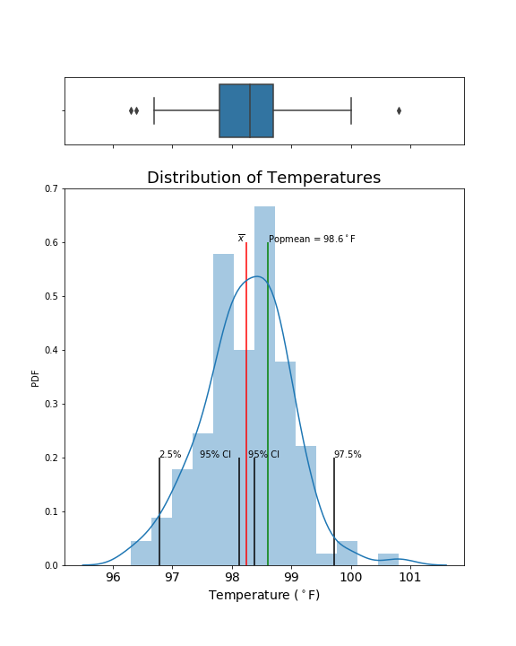

# EDA_Human_Body_Temperature

In this exercise, you will analyze a dataset of human body temperatures and employ the concepts of hypothesis testing, confidence intervals, and statistical significance.

The mean normal body temperature was held to be 37∘∘C or 98.6∘∘F for more than 120 years since it was first conceptualized and reported by Carl Wunderlich in a famous 1868 book. But, is this value statistically correct?

Statistical analysis of the mean body temperature based on the sample data of size 130. 

# Learning Objective

- Identify variables tin the data to answer to a project question.
- Identify strong correlations between pairs of independent variables or between an
independent and a dependent variable.
- Practice identifying the most appropriate tests to use to analyse relationships between
variables.

# Notes
- [Information and data sources](http://www.amstat.org/publications/jse/datasets/normtemp.txt,http://www.amstat.org/publications/jse/jse_data_archive.htm)
- Python modules used for statistical analysis: [Scipy.Stats](https://docs.scipy.org/doc/scipy/reference/tutorial/stats.html)
- Many thanks to Cheryl H. for sharing the great data visualization samples with us.

