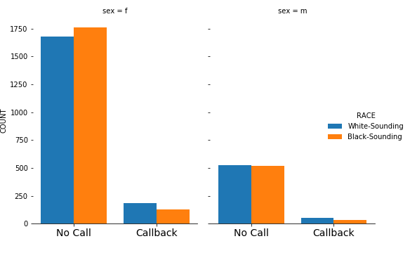

# EDA_Racial_Discrimination_Study

Racial discrimination continues to be pervasive in cultures throughout the world. Researchers examined the level of racial discrimination in the United States labor market by randomly assigning identical résumés to black-sounding or white-sounding names and observing the impact on requests for interviews from employers.

"Despite significant indications of progress, racial inequality is still pervasive in the U.S. labor market. Compared to whites, African Americans are twice as likely to be unemployed, and earn nearly 25 percent less when they are employed.

Names were chosen according to frequency data obtained from birth certificates of Massachusetts births from 1974 and 1979. The validity of the names' "blackness" or "whiteness" was confirmed by surveys in public areas in Chicago." [Source](https://www.povertyactionlab.org/evaluation/discrimination-job-market-united-states)

____

# Data
- In the dataset provided, each row represents a resume. 
- The 'race' column has two values, 'b' and 'w', indicating black-sounding and white-sounding. 
- The column 'call' has two values, 1 and 0, indicating whether the resume received a call from employers or not.
- Available here : https://www.aeaweb.org/articles?id=10.1257/0002828042002561
Note that the 'b' and 'w' values in race are assigned randomly to the resumes based on candidates's names when presented to the employer.

___

# Methodology & Results

- Female candidates or resumes from Female group have far higher NO CALL BACK rates than males. However, overall Female candites have better CALL BACKs in both WHITE SOUNDING and BLACK SOUNDING names.

- Among Females candidates, looks like Black Sounding Female group have a bit more NO CALL BACKs.

- Visuals suggests that there might be a discrimination case against MALE canditates, but we do not know if there more positions available for FEMALES than MALES. 

Overall white-sounding names received more call bakcs than blac-sounding names, to find out if the difference is significant among groups we would apply Two Sample Z test to compare samples.

We see that there is a significant difference in sample means of these two groups, however we do not know if this reflects the population characteristics of those groups. We use statistical test to see if this sample represents real situation.

**Null Hypothesis**: There is no difference in the proportion of callbacks for white-sounding names and the proportion of callbacks for black-sounding names:

**Alternative Hypothesis**: There is a significant difference in the  proportion of callbacks for white-sounding names and the proportion of callbacks for black-sounding names:

**Significance Level**: 95% Confidence:

alpha = 0.05

Margin of Error:  0.01525512602821483

The Confidence Interval is:  (-0.04728798023766041, -0.016777728181230755)

Z statitics:  -4.108412152434346

p value:  3.983886837585077e-05

Both of the results above which is verification of one another tells that the p-value is less than 0.05, and the confidence interval does not contain zero, so there is strong evidence that the null hypothesis can be rejected. So

P(Z>Z_{obs} | H0) is less than 0.05

In other words, we found a z statistic that is more extreme than the z_critical value of 1.96 hence H0 can be rejected.

Therefore, there is a difference in the proportion of callbacks in white-sounding and black sounding groups. 

Results indicates that résumés with white-sounding names received about 40 percent more callbacks than those with black names, indicating that, all other things being equal, race is still an important factor in the American labor market.

