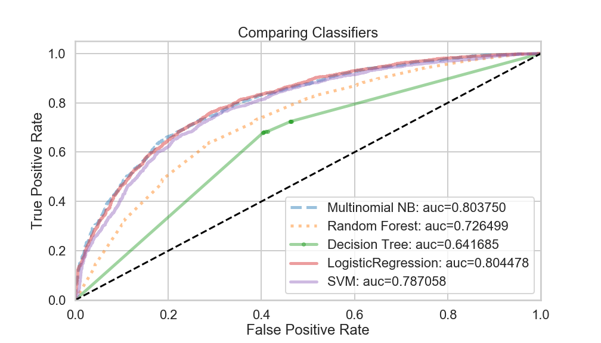

# Naive Bayes

-----

# The Data

Movie revies data from Rotten Tomatoes Dataset. The job is to classify given review made by reviewers either goes into Fresh (positive) or Rotten (negative) category using text analysis tools such as 

    pandas
    numpy
    scipy
    scikit-learn 
    NLTK
    Cython
    gensim

----

# Results
- First model applied was MultinomialNB with  Accuracy on Training Set: 0.923338
Accuracy on Test Set: 0.7783, after CountVectorizer() method to the text data. In this first model we see that there is remarkable overfit.

- Then tuning parameters of the previous model with GridSearch algorithm yield accuracy score of Accuracy on training data: 0.798244 and Accuracy on test data:     0.712358. That helped with the overfitting problem.

- This model with optimal paramters suprisingly bad job at classifying unseen negative review as positive review with $95 % $ probability.

- We tested performance a couple of classification models such as the king of forest RandomforestClassifier, SVM, MultinominalNB, LogisticRegression and DecisionTreeClassifier with default parameter setting. In this plot you will see classification results based on weighted text data with TF-IDF tool. The winner of this part is MultinomialNB with higher true positive rate and $80%$ area under the curve metrics.

- Latent Dirichlet Allocation technique is used to group text data based on topic. With almost 82% certainty our LDA approach is classified the unseen text in the first topic. The problem with grouping topics is that the movie reviews do not have distinct topics so the clusters may not separated well which may cause mis-classifications.

- Laslty, Word2Vec approach is applied to take meanings/sentiment of words into account in the classification process. Details about Word2Vec and LDA methods included in the notebook. Here is the results of different classifiers after Word2Vec applied.

---- 

# Refences

- [Lab 10 of Harvard's CS109](https://github.com/cs109/2015lab10)
- [Chi_Square_Feature_Selection](http://nlp.stanford.edu/IR-book/html/htmledition/feature-selectionchi2-feature-selection-1.html)
- [LDA](https://towardsdatascience.com/light-on-math-machine-learning-intuitive-guide-to-latent-dirichlet-allocation-437c81220158)
- [Topic_Modeling](https://medium.com/nanonets/topic-modeling-with-lsa-psla-lda-and-lda2vec-555ff65b0b05)
- [Topic Modeling and LDA](https://towardsdatascience.com/topic-modeling-and-latent-dirichlet-allocation-in-python-9bf156893c24)
- [Word2Vec](http://kavita-ganesan.com/gensim-word2vec-tutorial-starter-code/#.XCu59PxOnUI)
- [Word2Vec Application](https://www.kaggle.com/c/word2vec-nlp-tutorial#setting-up-your-system)

